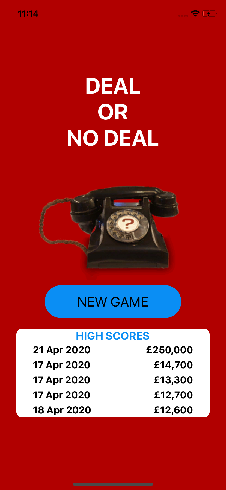
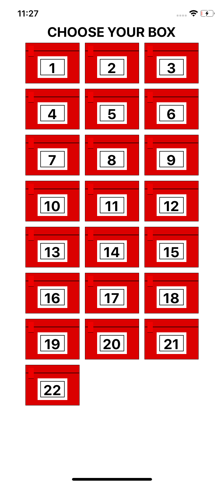
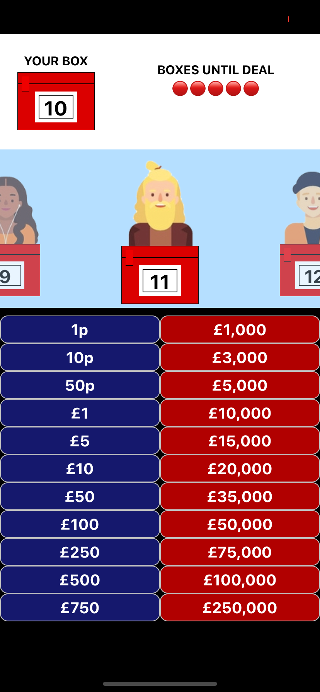
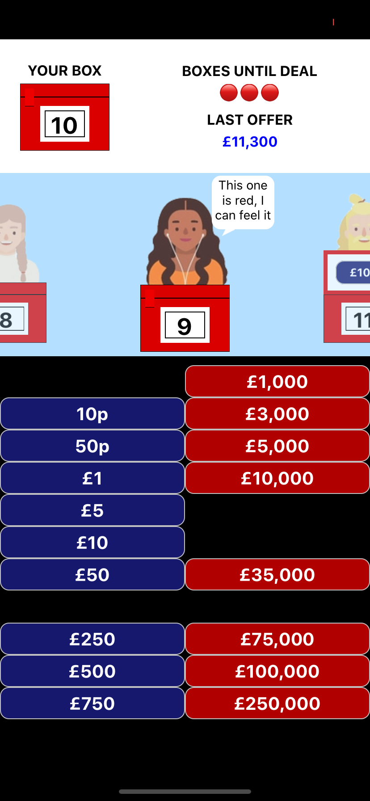
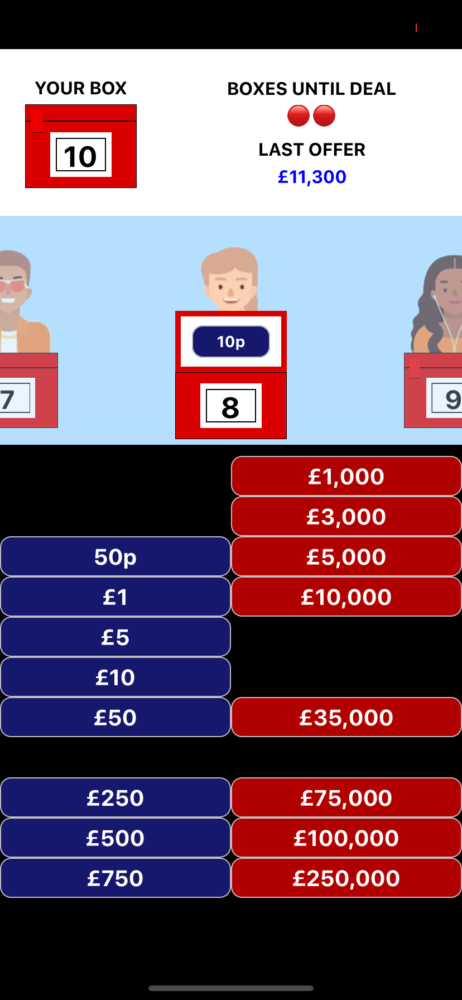
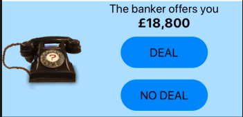
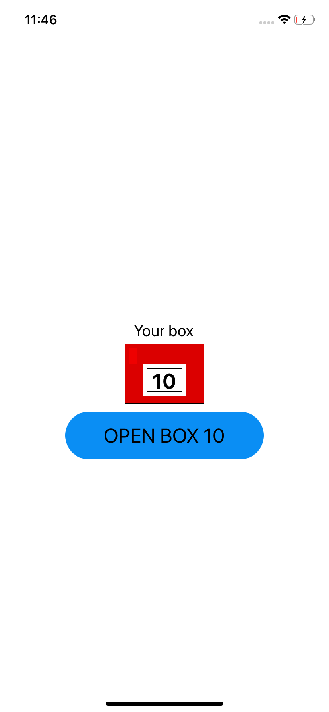
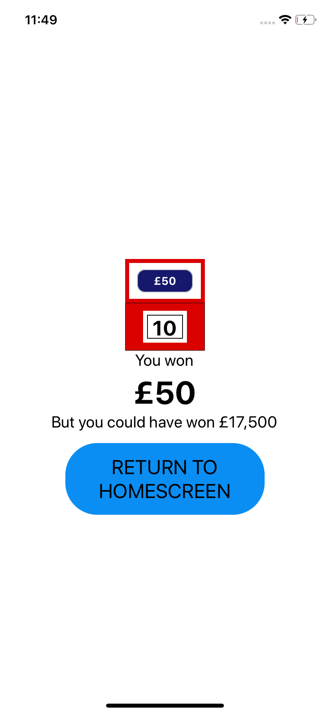

# Deal or No Deal 
### Project Overview and Motivation
At the time of making this I am currently on furlough as a result of the COVID-19 outbreak. I've decided to use some of the time away from work to make some fun personal projects. 

This project is a mobile app based on the gameshow <a href='https://en.wikipedia.org/wiki/Deal_or_No_Deal_(British_game_show)'>Deal or No Deal</a>. I built it using React Native.

The game is played using 22 boxes each of which contain an amount of money ranging from 1p to £250,000. The player picks one of the boxes at random and then gradually eliminates the other boxes until only 1 other box remains. At points during this process the player is offered an amount to buy their box from the banker. If they accept the deal they end the game with that amount of money, if they decline they continue the to elimate other boxes and amounts from the game.

---

### Timeframe
2.5 weeks (April 2020)

---

### User Journey
The app loads onto the screen below. The previous 5 best scores (if there are any) are shown in the box below.



After pressing 'new game' the player is asked to choose their box at random.



Once a box has been selected they are taken to the game screen. 

The top section of the screen shows the players box, how many selections they need to make before recieving an offer, their previous offer and the offer they dealt at (if they did).

The middle section is a carousel of all the other boxes. Like in the TV show some of the characters will give their thoughts on what they think is in their box.

The bottom part of the screen shows which values remain in the game.





When the banker makes an offer the middle section of the screen is replaced with a ringing phone followed by the offer.




Once only one other box remains the end of game screen appears. The content of this screen depends on the actions taken by the player during the game. At this point if the player has not accepted any of the deal they must open thier box or if the banker offers the swap they may choose the other box instead.





---
### Lets make a deal!

One of the biggest challenges for this app was to create a realistic function for the banker. In the show the banker can manipulate the amount offered to either encourage the player to keep going or to tempt them to stop. In order for the gameplay to feel reall I had to come up with a way to simulate this in a function. In the show the banker will generally offer less money at the start of the game then gradually increase it as the game progresses.

My final version of this works as follows:

- Take the average of all the remaining values.

- Multiply it by an increasing fraction based on the number of deals remaining. i.e. for the first deal the average is multiplied by 0.4.

- Multiply this number by a randomly generated number between 0.9 and 1.1.

There was a bug where the offer would be 0 if you only had values which were less than £1 left on the board so I included a conditional to catch that.

```
export const offerDeal = (remainingValues, turnCounter) => {
 const sortedRemainingValues = remainingValues.sort((a, b) => a - b)
 const averageOfRemainingBoxes = Math.round(remainingValues.reduce((acc, value) => acc + value, 0) / remainingValues.length);
 const dealNumber = bankerTurns.indexOf(turnCounter);
 const gameDeduction = deductionPercentages[dealNumber];
 const randomFactor = (Math.floor(Math.random() * (11 - 9)) + 9) / 10;
 const newOffer = Math.round((averageOfRemainingBoxes * gameDeduction) * randomFactor);

 const heighestAmountLeft = sortedRemainingValues[sortedRemainingValues.length - 1];

 if (newOffer < 1) {
  if (heighestAmountLeft === 0.5) return 0.2
  return 0.05
 }

 return newOffer;
}
```
I'm sure that this method could be improved by someone better at Maths but after testing it on both myself and my wife it seems to work pretty well.

---


### Challenges

As mentioned above creating a realistic machanism for the banker was a challenge and took a lot of trail and error. The other major challenge was keeping track of the game data (which amount is in which box, which boxes have been opened, how many boxes have been opened, etc..).

### Wins

I was really pleased with the animations that I was able to add to the boxes and values as you open them. Also working out how to use Async Storage for the highscroes was a lot of fun. 

---

### Future features

I would like to have improved the end of game screen. It became a little messy with all the different scenarios and could do with a little more styling. 
